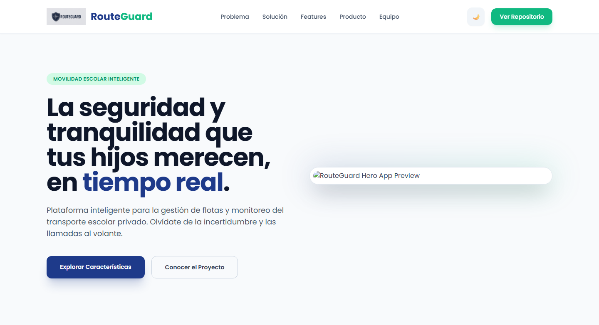
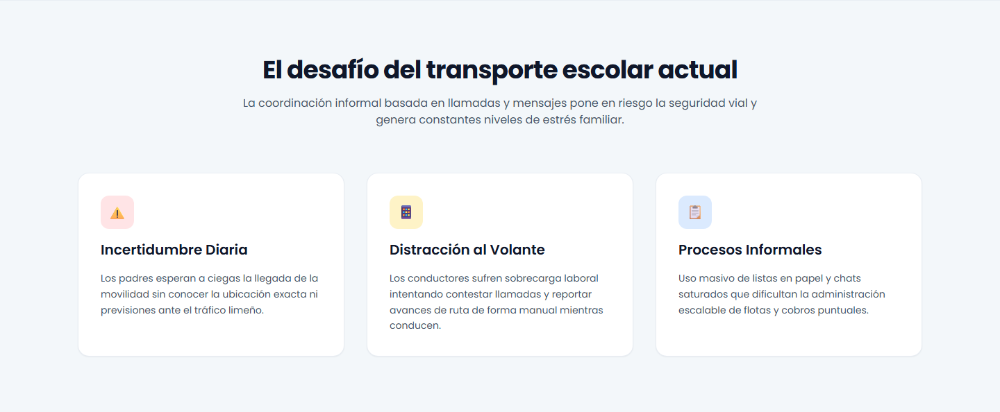
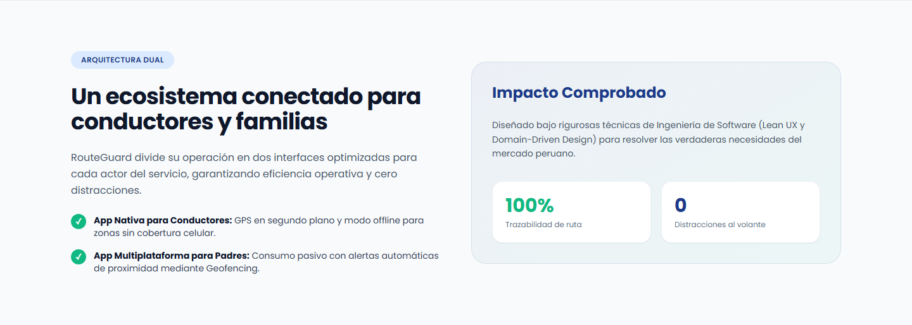
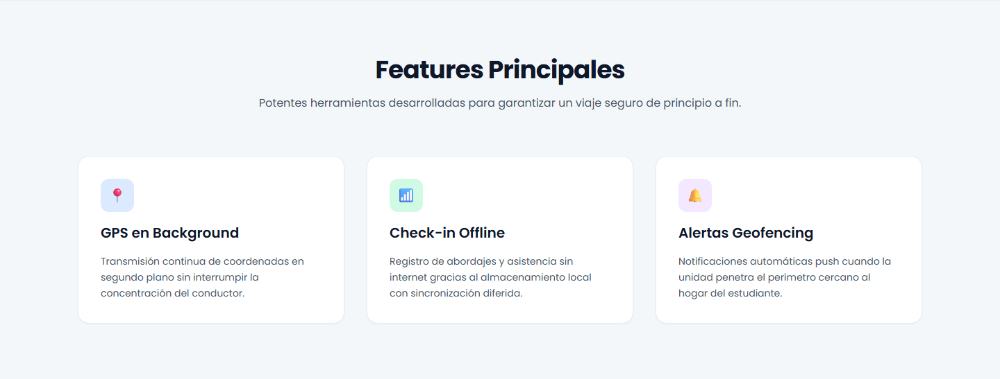
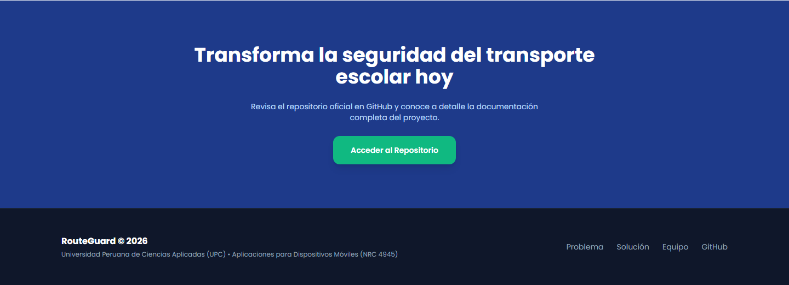

# RouteGuard Landing Page Solution

This is a solution for developing a landing page for RouteGuard, a smart platform for fleet management and real-time monitoring of private school transport in Peru.

## Overview
The RouteGuard Project replaces the informal coordination of school transport (phone calls, chat messages and paper lists) with a connected ecosystem for drivers and families. Parents see where the vehicle is without calling anyone, and drivers keep their attention on the road while the app reports the route for them.

### Visitors can explore:
- The problem of today's school transport: daily uncertainty for parents, driver distraction and informal processes.

- A connected ecosystem with two interfaces, one for drivers and one for families, with 100% route traceability and zero distractions at the wheel.

- The main features of the product: background GPS, offline check-in and geofencing alerts.

- The mobile app in action, with screenshots of the home and routes screens.

- The RouteGolem team behind the project.

- A light and dark theme switcher whose preference is saved in the browser.

- Full content in Latin American Spanish.

### Screenshots









### Links
- Solution URL : [https://upc-pre-202620-1acc0238-4945-routegolem.github.io/routeguard-landing-page/](https://upc-pre-202620-1acc0238-4945-routegolem.github.io/routeguard-landing-page/)
- Project report : [https://github.com/upc-pre-202620-1acc0238-4945-routegolem/routeguard-report](https://github.com/upc-pre-202620-1acc0238-4945-routegolem/routeguard-report)

### Project structure
```
index.html          Landing page markup
assets/
├── styles.css      Custom styles
├── script.js       Theme switcher (light / dark)
└── images/         Logo, page screenshots (p1-p7), app mockups and team photos
```

### Build with
- Semantic HTML5 markup
- Tailwind CSS (CDN) with a custom stylesheet
- Poppins typography (Google Fonts)
- Vanilla JavaScript (light / dark theme switcher)

### Author
- RouteGolem
  - Mathias De la Cruz
  - Jhony Manuel Francia
  - Marcelo Pareja
  - Nickolas Ramirez
